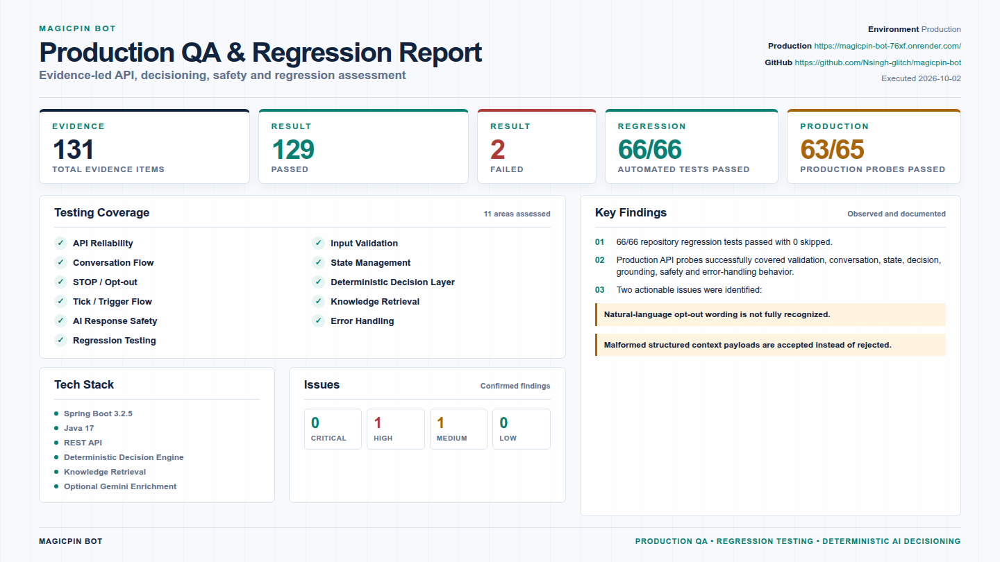

# magicpin Vera Bot

A Spring Boot 3 / Java 17 implementation of the magicpin Vera AI challenge
API. It selects grounded merchant actions, generates category-aware messages,
and handles merchant/customer conversation turns.

## Architecture

- Stateless HTTP controllers with an in-process `InMemoryStore`.
- Deterministic trigger scoring and messaging are the source of truth.
- Gemini is optional: it can polish only an already-decided message. Invalid,
  slow, unavailable, or ungrounded output always falls back safely.
- Context keys are collision-safe for the exact `(scope, context_id)` pair.
- Reply transitions are synchronized per `conversation_id`; separate
  conversations remain independent.

See [architecture.html](architecture.html) for the runtime diagram.

## QA Dashboard



Open the [interactive QA dashboard](QA_DASHBOARD.html) for the full-size report.

## API

| Endpoint | Success | Purpose |
| --- | --- | --- |
| `GET /v1/healthz` | 200 | Liveness, uptime, in-memory context count |
| `GET /v1/metadata` | 200 | Bot identity, model strategy, version |
| `POST /v1/context` | 200 | Store or replace a context by `scope` + `context_id` |
| `POST /v1/tick` | 200 | Select grounded actions from supplied triggers |
| `POST /v1/reply` | 200 | Process a merchant/customer conversation turn |

`POST` endpoints require `Content-Type: application/json`. Invalid JSON or
wrong request shapes return controlled `400`/`415` responses.

### Minimal flow

```powershell
$base = "http://localhost:8080/v1"

Invoke-RestMethod -Method Post -Uri "$base/context" -ContentType "application/json" -Body @'
{
  "scope": "merchant",
  "context_id": "m_001",
  "payload": {
    "merchant_id": "m_001",
    "category_slug": "restaurants",
    "identity": { "name": "Saffron Table" },
    "signals": {}, "metrics": {}, "performance": {}
  }
}
'@

Invoke-RestMethod -Method Post -Uri "$base/tick" -ContentType "application/json" -Body @'
{
  "available_triggers": [{
    "id": "perf_001", "trigger_id": "perf_001", "kind": "perf_dip",
    "payload": { "merchant_id": "m_001", "drop_percent": 12 }
  }]
}
'@
```

`/tick` also accepts `active_trigger_ids` containing stored trigger IDs.
Actions include `send_as: "vera"` and a stable `suppression_key`.

## Local development

Requires Java 17 and Maven 3.8+.

```powershell
mvn clean test
mvn package
$env:PORT = "8080" # optional; 8080 is the default
java -jar target/bot-1.0.jar
```

Verify with:

```powershell
Invoke-RestMethod http://localhost:8080/v1/healthz
```

## Gemini configuration

Gemini is disabled by default. Keep the API key in the deployment secret
manager or process environment—never in a source file, Docker image, or git.

| Variable | Default | Purpose |
| --- | --- | --- |
| `GEMINI_ENABLED` | `false` | Enables optional message enrichment |
| `GEMINI_API_KEY` | empty | Gemini API key |
| `GEMINI_MODEL` | `gemini-3.1-flash-lite` | Gemini model |
| `GEMINI_TIMEOUT_MS` | `8000` | Bounded enrichment timeout |

```powershell
$env:GEMINI_ENABLED = "true"
$env:GEMINI_API_KEY = "set-this-in-your-secret-manager"
$env:GEMINI_MODEL = "gemini-3.1-flash-lite"
java -jar target/bot-1.0.jar
```

## Container deployment

```powershell
docker build -t magicpin-vera-bot:latest .
docker run --rm -p 8080:8080 -e PORT=8080 magicpin-vera-bot:latest
```

For optional Gemini enrichment, inject the key at runtime:

```powershell
docker run --rm -p 8080:8080 -e GEMINI_ENABLED=true -e GEMINI_API_KEY=$env:GEMINI_API_KEY magicpin-vera-bot:latest
```

Use `GET /v1/healthz` as the platform health probe. The image runs as a
non-root user, honours `PORT`, performs a tested Maven build, and supports
graceful shutdown.

## Operational limits

This challenge implementation intentionally keeps context and conversation
state in memory. State is lost on restart and is not shared between replicas.
Deploy a single replica for evaluator runs. Persistent/shared state and
authentication are deliberately out of scope unless a platform requirement
calls for them.
